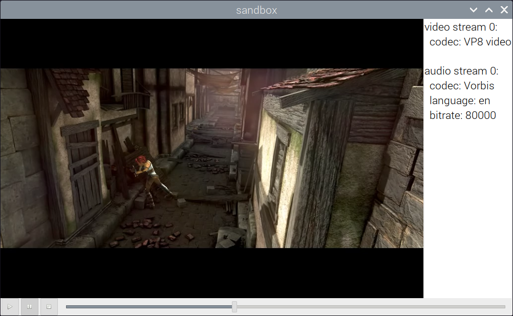

# GStreamer Player Application for Raspberry Pi based on GTK+ 3

A one-file adoption of GStreamer tutorial application with CMake build script.

To build, have

- `sudo apt install git cmake build-essential` -- development tools overall
- `sudo apt install libgstreamer1.0-dev libgstreamer-plugins-base1.0-dev libgstreamer-plugins-bad1.0-dev gstreamer1.0-plugins-base gstreamer1.0-plugins-good gstreamer1.0-plugins-bad gstreamer1.0-plugins-ugly gstreamer1.0-libav gstreamer1.0-tools gstreamer1.0-x gstreamer1.0-alsa gstreamer1.0-gl gstreamer1.0-gtk3 gstreamer1.0-pulseaudio` -- GStreamer related packages installed; it's nearly the copy of [original suggested command line](https://gstreamer.freedesktop.org/documentation/installing/on-linux.html?gi-language=c), however a few packages are removed, like Qt, as missing on Pis.
- `sudo apt-get install libgtk-3-dev` -- [GTK+ 3](https://docs.gtk.org/gtk3/index.html) for developer

